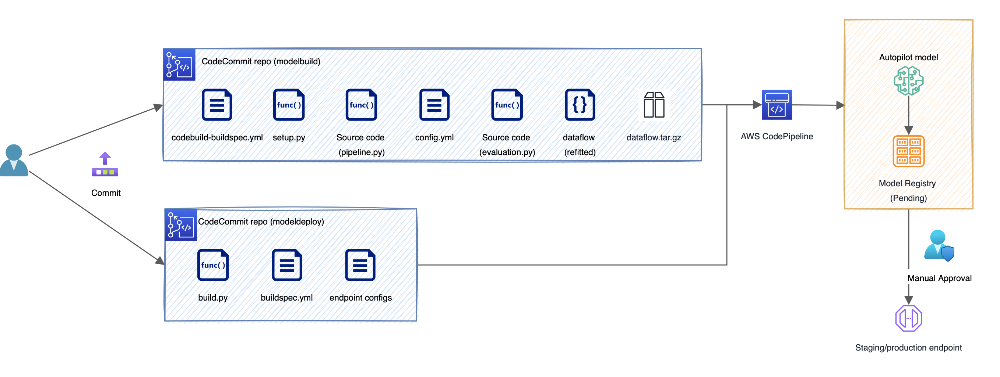

# MLOps for SageMaker Low-code

The workflow (as shown in the figure 1 below) covered in this repository consists of the following steps:

* *Step 1:* Starts with the data processing step using SageMaker Processing. This step uses the data flow file created in the experimental phase using Data Wrangler. It leverages data residing in one of the supported data sources, e.g., S3, Athena etc. 
* *Step 2:* The transformed output from Data Wrangler is used as an input to kick-off an Autopilot experiment. This step spawns multiple concurrent training jobs behind the scene to create candidate models. It also stack ranks the models and picks the winning model for our problem statement. 
* *Step 3:* Once the Autopilot experiment is complete and a best model is determined, we re-create a pipeline model which is a multi-container model with two core components - i) Data Wrangler feature encoder and ii) Autopilot prediction model. 
* *Step 4:* Using the re-created model in the previous step, we can now run batch scoring on a holdout or a test set using SageMaker Batch Transform. This step results in prediction outcomes for the data points in the test set. 
* *Step 5:* In this step, we take the prediction outcomes from the previous step and compare it against the actual ground truth labels for the holdout set and arrive at an objective metric, e.g., f-score. 
* *Step 6:* Once we have the objective metric estimated, we can use it as a threshold to decide if we want to register the model to SageMaker Model Registry or not. 
* *Step 7:* The last step finally registers the model to the model registry if it has passed the conditional threshold.

This repository also encapsulates the source code for SageMaker Projects that map to the CodeCommit repositories created by Projects for modelbuild and modeldeply. The CI/CD setup as shown at a high level in the figure below.

